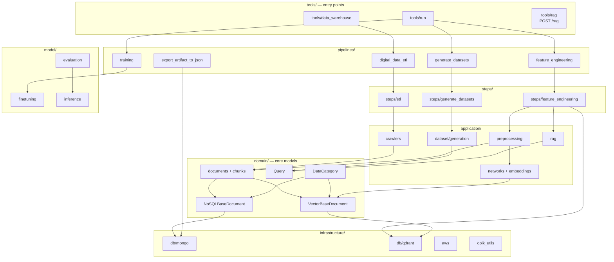

# Code Intelligence

Multi-layered code intelligence powered by codebase-memory-mcp, graphify, and repomix.

## Status

| Layer | Status | Details |
|-------|--------|---------|
| **Structural Graph** | Indexed | `D-AI-Projects-LLM-Engineers-Handbook`, 1234 nodes, 4184 edges |
| **Multimodal Graph** | Built (code-only) | 611 nodes, 1474 edges, 41 communities from code AST |
| **Context Pack** | Ready | 1,572,176 tokens, 161 files, compress mode |
| **Watcher** | Managed by MCP server | Auto re-indexes on git changes |

Notes:
- The multimodal graph is code-only because no semantic LLM API key is configured on this workstation. Doc/paper/image files (25) were skipped. Re-run semantic extraction after setting `GEMINI_API_KEY`, `OPENAI_API_KEY`, or `ANTHROPIC_API_KEY` to merge code and docs into one graph.

## Architecture



## Key findings

- **God nodes (graphify):** `DataCategory` (65 edges), `VectorBaseDocument` (47), `NoSQLBaseDocument` (31), `Query` (26), `CleanedDocument` (23).
- **Graph hotspots (codebase-memory):** `VectorBaseDocument.get_collection_name` (fan-in 9), `NoSQLBaseDocument.find` (9), `NoSQLBaseDocument.get_collection_name` (8), `get_category` (7), `model_dump` (7), `bulk_find` (6).
- **Layering:** `domain/` is the core (fan-in 59, fan-out 7). `application/` is internal (fan-in 13, fan-out 78). `etl`, `feature_engineering`, and `model` are entry-side layers (outbound only).
- **Main flow:** `tools/` configs drive `pipelines/`, which call `steps/`, which use `application/`, backed by `domain/` models and `infrastructure/` stores (MongoDB + Qdrant).
- **Routes:** `POST /rag` (RAG API in `tools/rag.py`).
- **Entry points:** `tools/data_warehouse.py`, `tools/run.py`.
- **Clusters:** 12 code communities; largest are `chunk_and_embed`/`load_to_vector_db` (44 members), `extract`/`find`/`save` (30), and `search`/`rag`/`generate`/`rerank`/`call_llm_service` (20).

## Quick Reference

| Question | Tool call |
|----------|----------|
| Who calls X? | `codebase-memory_trace_path(function_name="X", direction="inbound")` |
| What does X call? | `codebase-memory_trace_path(function_name="X", direction="outbound")` |
| Find by pattern | `codebase-memory_search_graph(name_pattern="...")` |
| Natural-language find | `codebase-memory_search_graph(query="...")` |
| Read a symbol | `codebase-memory_get_code_snippet(qualified_name="...")` |
| Dead code | `codebase-memory_search_graph(max_degree=0)` |
| Impact of changes | `codebase-memory_detect_changes(project="...")` |
| Architecture | `codebase-memory_get_architecture(project="...", aspects=["all"])` |
| Cross-doc references | `graphify_query_graph(question="...")` |
| God nodes | `graphify_god_nodes()` |
| Shortest path | `graphify_shortest_path(source="...", target="...")` |
| Pack for LLM | `repomix_pack_codebase(directory="...")` |
| Review blast radius | `code-review-graph_detect_changes_tool()` |

## How to re-index

```
graphify extract "D:\AI\Projects\LLM-Engineers-Handbook" --code-only
```

```
# structural graph (via MCP)
codebase-memory_index_repository(repo_path="D:/AI/Projects/LLM-Engineers-Handbook", mode="full")
```

The codebase-memory MCP server auto-refreshes watched projects in the background, so a manual rebuild is only needed after large external updates or ignore-rule changes.

## What it covers

- **Languages:** Python (116 files), YAML (13 configs), TOML (2).
- **Not indexed by design:** `.git`, `.vscode`, `llm_engineering/infrastructure/aws/deploy`, `images/*.png`, `images/*.jpg`.
- **Graph coverage:** clean. Zero `parse_partial` files and zero `skipped` files reported by `codebase-memory_index_status`.

## Agent tiers

| Tier | When to use | Tools |
|------|-------------|-------|
| **Scout** | Quick lookup, provisional | `codebase-memory_search_graph` / `get_code_snippet` + `check_index_coverage` |
| **Verify** | Task-directed evidence | `trace_path`, `query_graph`, `get_architecture`, graphify queries, coverage checks |
| **Auditor** | Full bounded verification | All graph tools, both call directions, complete pagination, coverage for every cited path |
